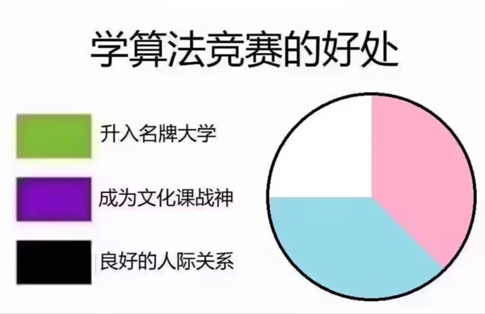

# Algorithm Complete

对我所知道的计算机（算法/数学）资源进行汇总整理

>~~其实不仅仅是信息学奥赛的算法~~

## 目录

...

## 理论材料

### 静态资源

#### 书籍

- [Introduction to Algorithms, 4th Edition](https://mitpress.mit.edu/9780262533058/introduction-to-algorithms/) 典中典
- [Algorithms, 4th Edition](https://algs4.cs.princeton.edu/home/) 这也是经典
- [Mathematics in Programming (同构：编程中的数学)](https://link.springer.com/book/10.1007/978-981-97-2432-1) 大佬评价说有《几何原本》的味道，喜欢Haskell的有福了
- [Dr. Dobb’s Essential Books on Algorithms & Data Structures](https://archive.org/details/DDJALGCD) 《编程珠玑》中对其进行了推荐，是复杂的算法和数据结构的课程包
- [Discrete Mathematics and Its Applications, 8th Edition](https://ia600600.us.archive.org/7/items/mathematics_202103/Rosen%2C%20Kenneth%20H%20-%20Discrete%20mathematics%20and%20its%20applications-McGraw-Hill%20%288th%20ed%29%282019%29.pdf) 这位更是重量级嗷
- [Linear Algebra for Computational Sciences and Engineering](https://link.springer.com/book/10.1007/978-3-030-21321-3) 更适合计算机学生体质的线性代数

#### 论文

- [Correctness of Dijkstra’s algorithm](https://community.wvu.edu/~krsubramani/courses/fa05/gaoa/qen/dijk.pdf) 迪杰斯特拉算法为什么是对的
- [Universal Optimality of Dijkstra Via Beyond-Worst-Case Heaps](https://ieeexplore.ieee.org/document/10756107) 迪杰斯特拉算法确实牛逼
- [Optimal Bounds for Open Addressing Without Reordering](https://ieeexplore.ieee.org/document/10756091) 哈希表方面，据说是推翻了图灵奖得主姚期智40年前提出的猜想

### 在线资源

#### GitHub仓库（感谢开源🙏）

- [ACM-ICPC-Preparation](https://github.com/BedirT/ACM-ICPC-Preparation)
- [Shanghai Tech University](https://github.com/i-TechX/iTechX/tree/file-base/courses/CS101/CS101.01_Fall_2022/Lecture%20Slides%20%E6%95%99%E5%AD%A6%E8%AF%BE%E4%BB%B6)
- [Elementary Functional Algorithms（算法新解）](https://github.com/liuxinyu95/AlgoXY)
- [StoneValley](https://github.com/coshcage/StoneValley) 个人维护的C语言通用算法库
- [刘汝佳（紫书+蓝书）](https://github.com/klb3713/aoapc-book)

#### WiKi/Note

- [OI-wiki](https://oi-wiki.org/) 伟大无需多言
- [labuladong](https://labuladong.online/zh/algo/home/) 这也是大佬
- [hello-algo](https://www.hello-algo.com/chapter_hello_algo/)
- [Dictionary of Algorithms and Data Structures](https://xlinux.nist.gov/dads/) NIST维护的算法和数据结构词典

#### 神奇网站

- [Bit HACK](https://graphics.stanford.edu/~seander/bithacks.html)
- [Conway's Game of Life](https://golly.sourceforge.io/)

#### 课程

- [Algorithm Analysis](https://aofa.cs.princeton.edu/home/) 算法分析这一块
- [Advanced Topics In Statistical Machine Learning](https://www.robots.ox.ac.uk/~twgr/teaching/) 机器学习这一块
- [Linear and Semidefinite Programming (Advanced Algorithms)](https://www.cs.cmu.edu/afs/cs.cmu.edu/academic/class/15859-f11/www/)

## 综合平台

- [Luogu](https://www.luogu.com.cn/)
- [ACwin](https://www.acwing.com/about/)
- [LeetCode](https://leetcode.com/)
- [Codeforces](https://codeforces.com/)
- [AtCoder](https://atcoder.jp/)
- [HackerRank](https://www.hackerrank.com/)
- [CodeChef](https://www.codechef.com/)
- [TopCoder](https://www.topcoder.com/)
- [SPOJ](https://www.spoj.com/)
- [Sphere Online Judge](https://www.spoj.com/)
- [UVa Online Judge](https://onlinejudge.org/)
- [Timus Online Judge](https://acm.timus.ru/)
- [Kattis](https://open.kattis.com/)
- [Codewars](https://www.codewars.com/)
- [Exercism](https://exercism.io/)
- [Project Euler](https://projecteuler.net/)
- [UOJ](https://uoj.ac/)
